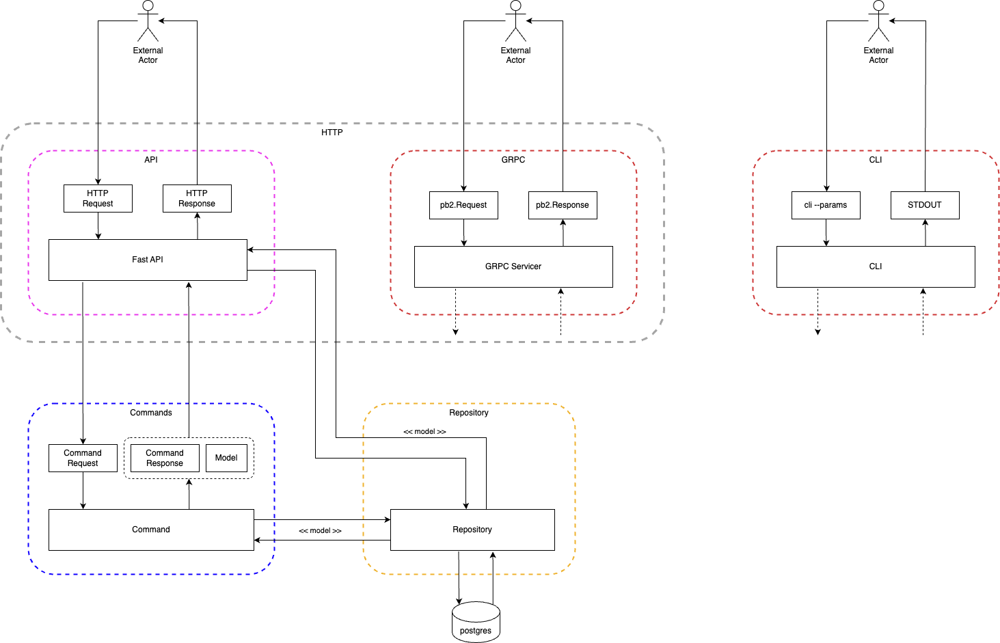

# Python Architecture

This Python architecture template is designed to combine simplicity with robust architectural principles, ensuring scalable and maintainable solutions without sacrificing ease of use.

The template integrates key patterns such as CQRS (Command Query Responsibility Segregation), versioned APIs for smooth evolution of interfaces, Dependency Injection for clean and modular code and the Unit of Work pattern to manage transactions effectively, while utilizing PostgreSQL managed by SqlAlchemy as the primary data store.

